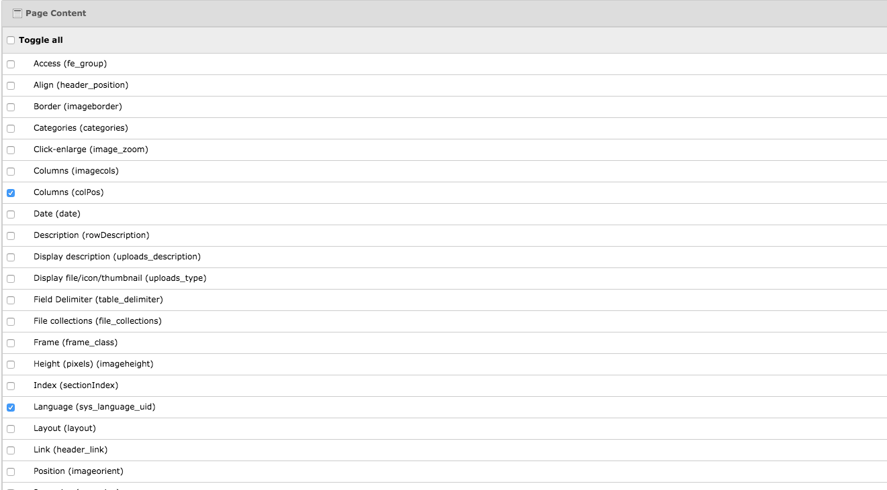
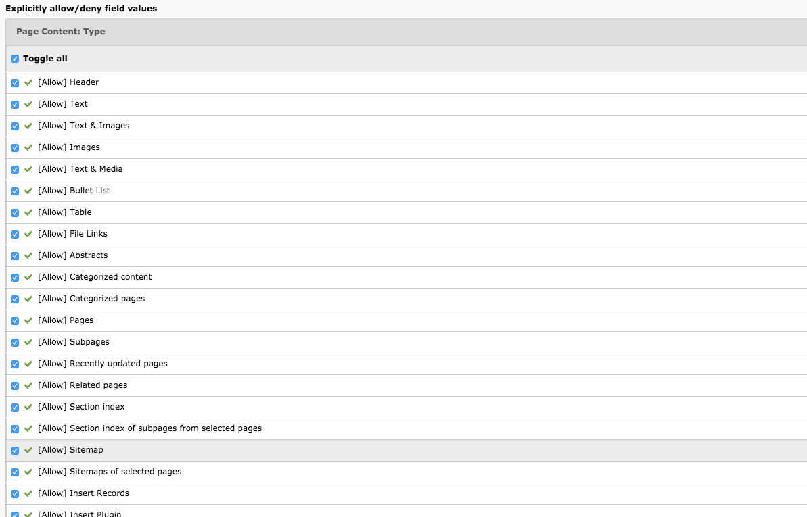
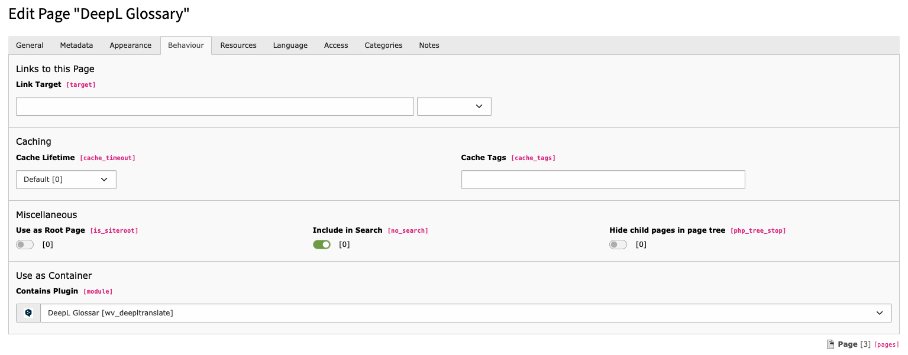

[](https://packagist.org/packages/web-vision/wv_deepltranslate)
[](https://get.typo3.org/version/11)
[](https://get.typo3.org/version/10)
[](https://packagist.org/packages/web-vision/wv_deepltranslate)
[](https://packagist.org/packages/web-vision/wv_deepltranslate)

## What does it do?

Fork of deepltranslate from pitsolutions. This extension provides option to translate content elements and tca record fields to desired language(supported by [Deepl](https://www.deepl.com/en/api.html)).
As a fallback, Google Translate option is also provided as they provide support for many languages that deepl isn’t providing.
For both Deepl translate and Google Translate, there are two modes-normal and autodetect, where the later autodetect source language and translates it to the desired language.

## Installation

You can install the extension using:

- Extension manager
- or composer

```bash
composer req web-vision/wv_deepltranslate
```

Once installed ,there appears a Deepl back end module with a settings tab.

## Extension Configuration

Once you installed the extension, you have to set the Deepl API Key under extension configuration section

## Translating Content Elements

Once the extension is installed and Api key provided we are good to go for translating content elements.
On translating content element,There appears additional four options apart from normal translate and copy.

- Deepl Translate(auto detect).
- Deepl Translate.
- Google Translate(auto detect).
- Google Translate.

## Translating TCA Records

Deepltranslate supports translation of specific fields of TCA records.It understands fields which need to be translated,
only if their `l10n_mode` is set to `prefixLangTitle`. For example if you need translation of fields of tx_news (teaser and bodytext),
You need to override those fields like follows:

Add it to TCA/Overrides:

```bash
example-extension/Configuration/TCA/Overrides/tx_news_domain_model_news.php
```

```php
<?php

if (!defined('TYPO3_MODE')) {
    die();
}

$GLOBALS['TCA']['tx_news_domain_model_news']['columns']['bodytext']['l10n_mode'] = 'prefixLangTitle';
$GLOBALS['TCA']['tx_news_domain_model_news']['columns']['teaser']['l10n_mode'] = 'prefixLangTitle';
```

## Translating Content Elements and TCA Records - Editor users

For the perfect working of deepltranslate with editor users , we need to make sure that the editor has some necessary permissions in `Access Lists`.
Make sure editors have the following permissions:

* Tables (modify) - Better provide permission to all core tables and necessary third party extension tables.
* Allowed excludefields

1. Page Content - Atleast provide permissions to `Columns (colPos)`, `Language (sys_language_uid)` and `Transl.Orig (l18n_parent)`



### Page Content

2. Other Tca record fields


### Other TCA Fields

> Explicitly allow/deny field values

1. Page Content: Type - Allow all to use all CE types.



### CE types

## Deepl Module Settings

The settings module helps to assign the sytem languages to either deepl supported languages or to Google supported languages.
For example, you can assign German under Austrian German sys language if you wish.
For assigning a language to a sys language you must enter it’s isocode(ISO 639-1).

## Deepl Glossary

After setting up the core languages create a standard page in page tree.

- In the "Behavior" tab select the option DeepL Glossar in Contains Plugin options.




- Now you can create DeepL Glossary records on that page. Go to the list module and Create a new record, select the DeepL Glossaries record.


- Here you can enter the Term and Description for you Glossary entry and add the Translation term how it should be handled by DeepL translate.


- As soon as you have an entry in the glossary it will be considered by DeepL Translation for the pair language.
## FAQ

See faq [here](https://docs.typo3.org/typo3cms/extensions/wv_deepltranslate/Faq/Index.html)

## Sponsors
We appreciate very much the sponsorships of the developments and features for the DeepL Translate Extension for TYPO3.

### DeepL Glossary feature sponsored by
* [Universität Osnabrück](https://www.uni-osnabrueck.de)
* [Hochschule für Musik Würzburg](https://www.hfm-wuerzburg.de)
* [Carl von Ossietzky Universität Oldenburg](https://uol.de/)
* [Friedrich-Ebert-Stiftung](https://www.fes.de)
